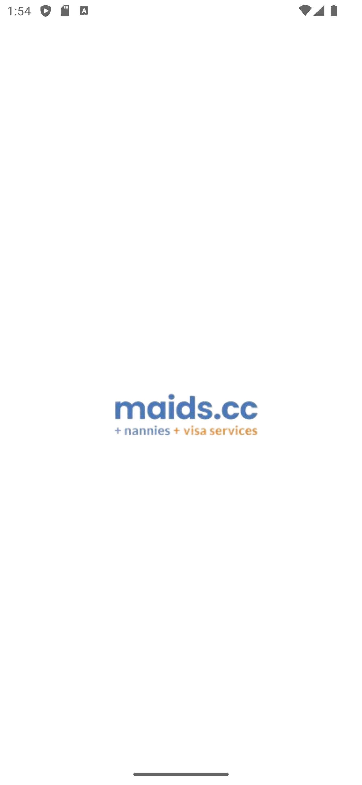
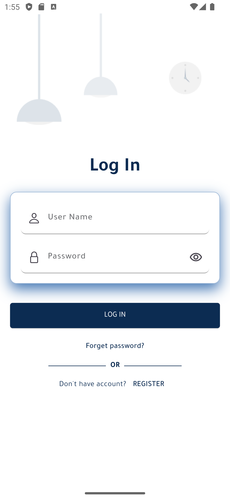
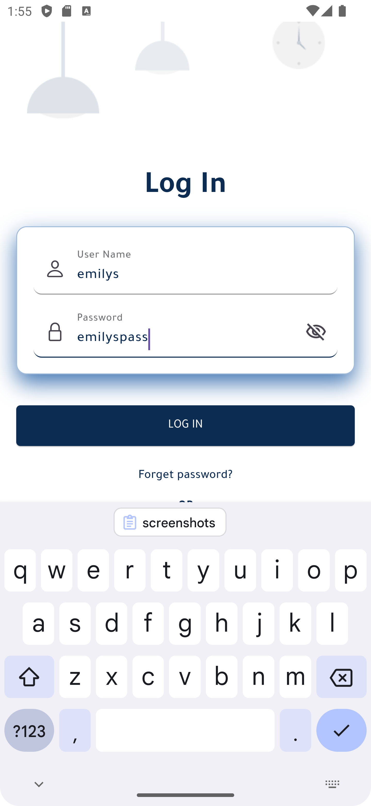
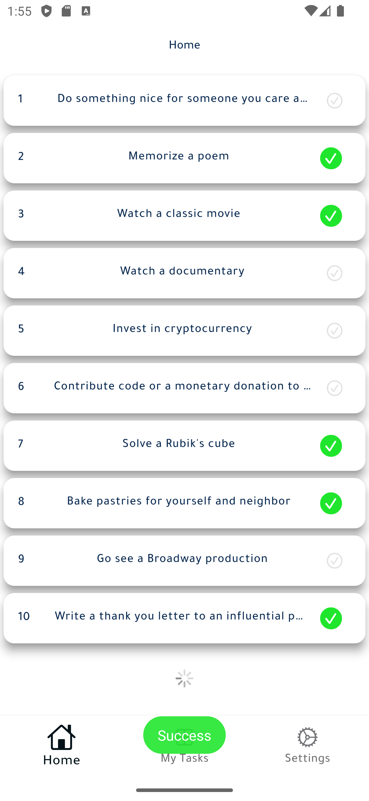
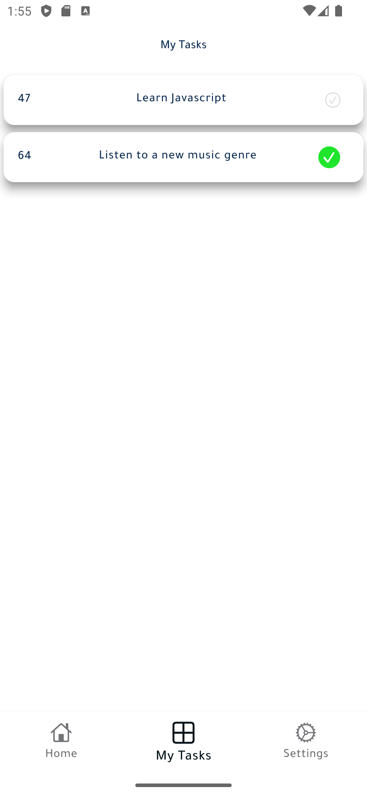
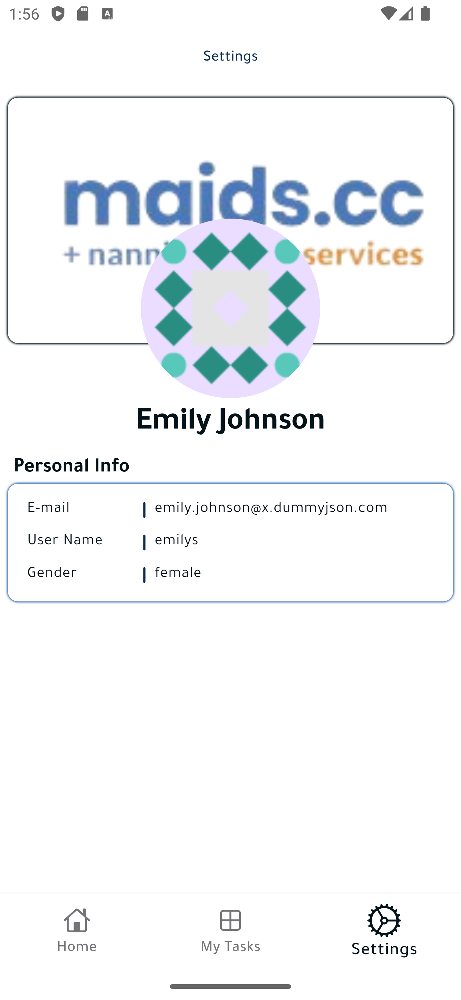

# Task Management System

Task manager app using Flutter that allows users to manage their tasks efficiently.


A robust and intuitive Task Management System built with Flutter. This system allows users to create, edit, delete, and view tasks, as well as login to manage their task list. The project follows clean architecture principles and includes comprehensive tests.

## Table of Contents
- [Features](#features)
- [Screenshots](#screenshots)
- [Installation](#installation)
- [Usage](#usage)
- [Testing](#testing)
- [Folder Structure](#folder-structure)
- [Contributing](#contributing)
- [License](#license)

## Features
- **User Authentication**: Login functionality to manage tasks securely.
- **Task Management**: Create, edit, delete, and view tasks.
- **Clean Architecture**: Well-organized code following clean architecture principles.
- **Comprehensive Testing**: Includes unit and integration tests for all functionalities.

## Screenshots
<p align="center">
  
  
  
  
  
  
</p>

## Installation
To get started with this project, follow these steps:

1. **Clone the repository:**
   ```sh
   git clone https://github.com/your-username/task-management-system.git
   cd task-management-system
